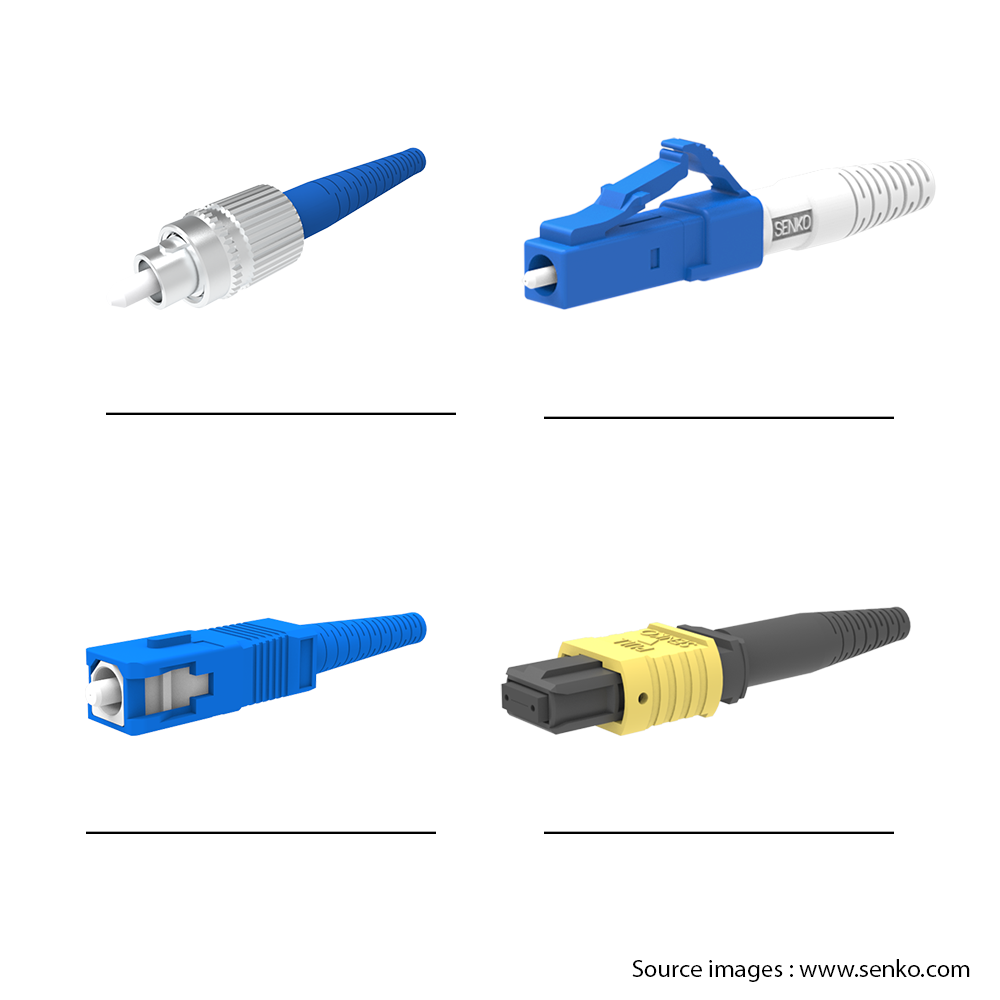

# E-117-ExSoutien01 – Exercice de Soutien 01

**Module :** ETML – Module 117

**Exercice :** Soutien 01

**Auteur :** Alexis Gugler

**Création :** 11.11.2024

**Version :** 10 du 21.05.2025

**Durée estimée :** 45-70 minutes

---

## 🧑‍🎓 Informations de l’élève

* **Nom :** `__________________________`
* **Prénom :** `__________________________`
* **Date :** `__________________________`

---

## 📌 Consignes générales

* **Nom du fichier à rendre :** `X-117-ExSoutien01-nom-prenom.extension`
* **Lieu de dépôt :** Canal MS Teams, dans la section **Fichiers** du cours, selon les consignes de l’enseignant.
* **Formats acceptés :** `.DOCX`, `.PDF`, ou autre selon les consignes de l'enseignant
* **Date limite de rendu :** Dans les 45-70 minutes

---

## 🎯 Objectif

Renforcer la compréhension des concepts de base en réseaux informatiques, en particulier en matière de câblage, de connecteurs, d'infrastructure réseau, et du rôle des éléments actifs et passifs.

---

            

## 🛠️ Directives de travail

### 1. Câblage et infrastructure réseau

* Expliquez la différence entre une **goulotte** (chemin de câble) et un **faux sol**. Donnez un exemple d'utilisation pour chacun.

`______________________________________________________________`
`______________________________________________________________`
`______________________________________________________________`

* Quels sont les **avantages d’utiliser un patch panel** dans une infrastructure de câblage réseau ? Donnez au moins deux raisons.

`______________________________________________________________`
`______________________________________________________________`
`______________________________________________________________`

---

### 2. Distance et support de transmission

* Quel est le **rôle d’un répéteur** dans un réseau ? Quand est-ce nécessaire ?

`______________________________________________________________`
`______________________________________________________________`
`______________________________________________________________`

* Pourquoi la **longueur maximale** d’un câble RJ45 est-elle **limitée à 100 mètres** ?

`______________________________________________________________`
`______________________________________________________________`
`______________________________________________________________`

* Comparez les câbles **catégorie 5, 6 et 7** en termes de **vitesse de transmission**.

`______________________________________________________________`
`______________________________________________________________`
`______________________________________________________________`

---

### 3. Éléments actifs et passifs dans un réseau

* Qu’est-ce qu’un **élément actif** dans un réseau ? Donnez deux exemples et expliquez leur fonction.

`______________________________________________________________`
`______________________________________________________________`
`______________________________________________________________`

* Qu’est-ce qu’un **élément passif** ? Donnez un exemple.

`______________________________________________________________`
`______________________________________________________________`
`______________________________________________________________`

---

### 4. Systèmes d’exploitation et types de réseau

* Dans quels cas le **choix du système d’exploitation** influence-t-il l’installation d’un réseau ? Donnez deux situations.

`______________________________________________________________`
`______________________________________________________________`
`______________________________________________________________`

* Expliquez la différence entre une **architecture poste à poste** et un **réseau structuré en workgroup**.

`______________________________________________________________`
`______________________________________________________________`
`______________________________________________________________`

---

### 5. Connecteurs et supports

1) À partir de l’image fournie, **identifiez le type de connecteur FO**.

  

2) Complétez le tableau suivant :

| Connecteur | Type de fibre            | Mode de fixation      | Format                | Usage typique           | Environnement courant         | Encore utilisé aujourd'hui ?           |
|:----------:|:------------------------:|:---------------------:|:---------------------:|:------------------------:|:-----------------------------:|:--------------------------------------:|
| `_____`         | Monomode                 | À visser              | Simplex               | Test, anciens SAN        | Laboratoires, vieux réseaux   | ❌ Rare / obsolète                     |
| `_____`         | Monomode ou multimode    | Push-pull (clip)      | Simplex               | FTTH, anciens réseaux    | Domicile, campus anciens      | ⚠️ Encore présent, mais déclin         |
| `_____`         | Monomode ou multimode    | Push-pull (clip)      | Duplex                | Switchs, serveurs, routeurs        | Datacenters, entreprises, domiciles      | ✅ Très courant                         |
| `_____`        | Monomode ou multimode    | Push-pull (clip)      | Multifibre (8/12/24)  | Haut débit (40G/100G)    | Datacenters haute densité     | ✅ En forte croissance                  |

3) Citez **trois types de supports physiques** de transmission de données et donnez **un exemple d'utilisation** pour chacun.

`______________________________________________________________`
`______________________________________________________________`
`______________________________________________________________`
`______________________________________________________________`
`______________________________________________________________`
`______________________________________________________________`

---

### 6. Technologies de transmission sans fil

* Citez **trois technologies sans fil** utilisées en réseau et décrivez **leur utilisation principale** (ex : Wi-Fi pour les réseaux locaux sans fil).

`______________________________________________________________`
`______________________________________________________________`
`______________________________________________________________`

---
        

### 7. Protocoles et normalisation

* Définissez le terme **protocole** en informatique. Pourquoi est-il essentiel pour la communication réseau ?

`______________________________________________________________`
`______________________________________________________________`
`______________________________________________________________`
`______________________________________________________________`

* Donnez **deux exemples** de **protocoles réseaux courants** et expliquez leur fonction.

`______________________________________________________________`
`______________________________________________________________`
`______________________________________________________________`
`______________________________________________________________`

---

# BROUILLON / REPONSES
`______________________________________________________________`
`______________________________________________________________`
`______________________________________________________________`
`______________________________________________________________`
`______________________________________________________________`
`______________________________________________________________`
`______________________________________________________________`
`______________________________________________________________`
`______________________________________________________________`
`______________________________________________________________`
`______________________________________________________________`
`______________________________________________________________`
`______________________________________________________________`
`______________________________________________________________`
`______________________________________________________________`
`______________________________________________________________`
`______________________________________________________________`
`______________________________________________________________`
`______________________________________________________________`
`______________________________________________________________`
`______________________________________________________________`
`______________________________________________________________`
`______________________________________________________________`
`______________________________________________________________`
