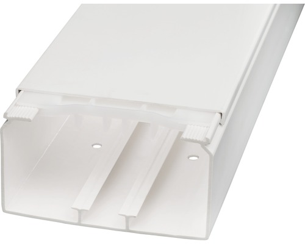
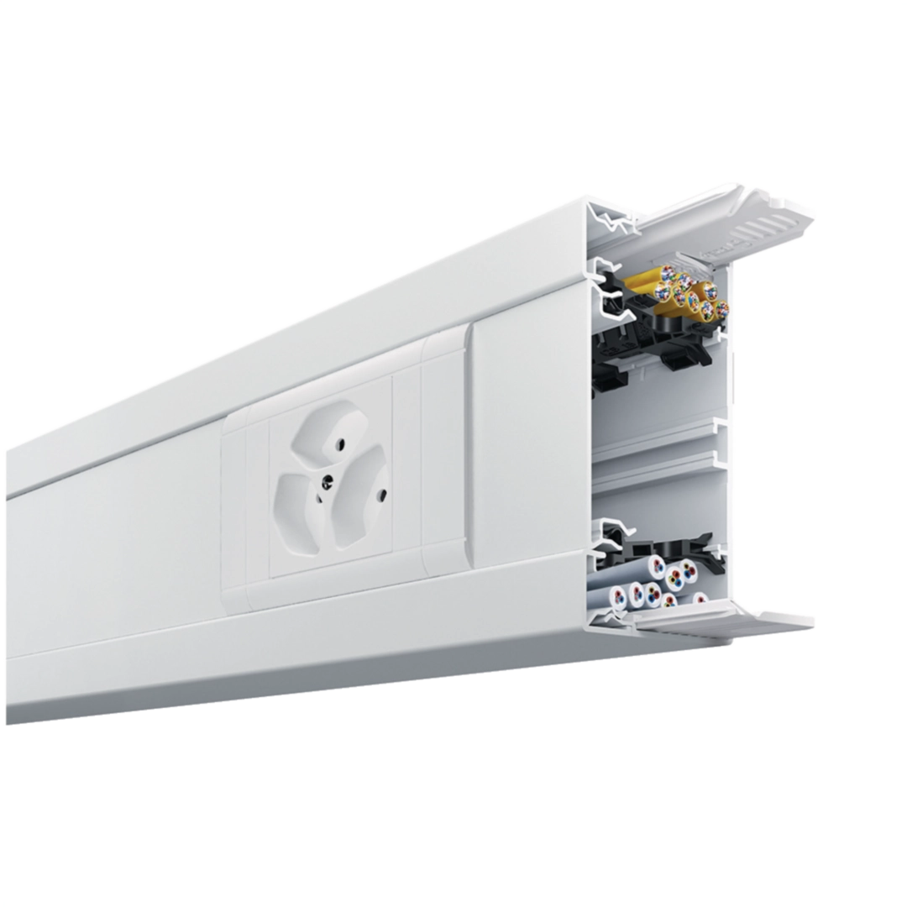
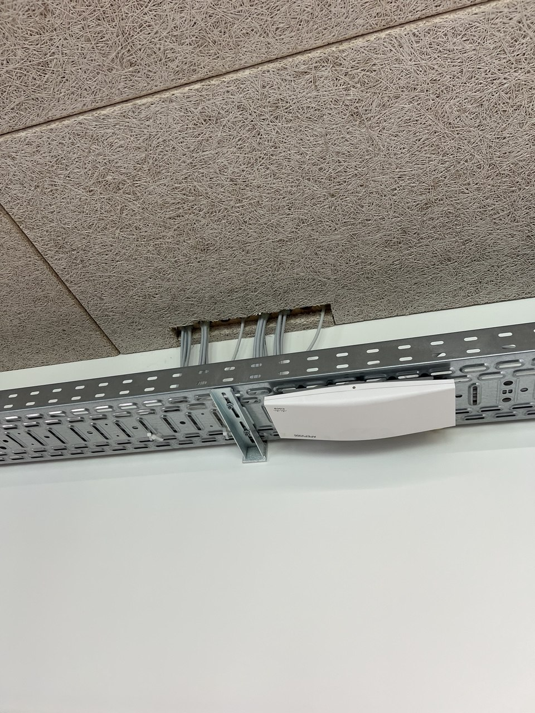
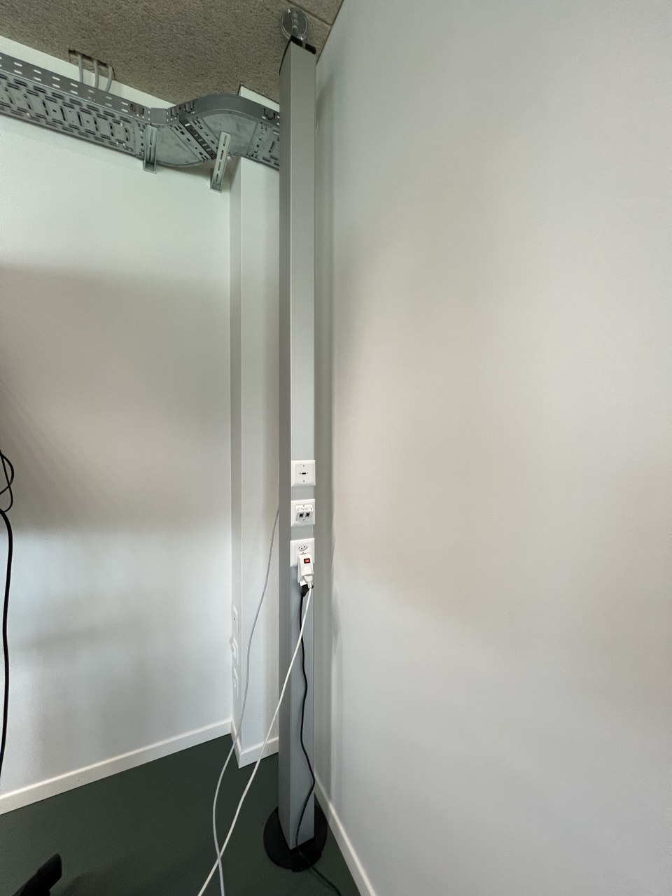
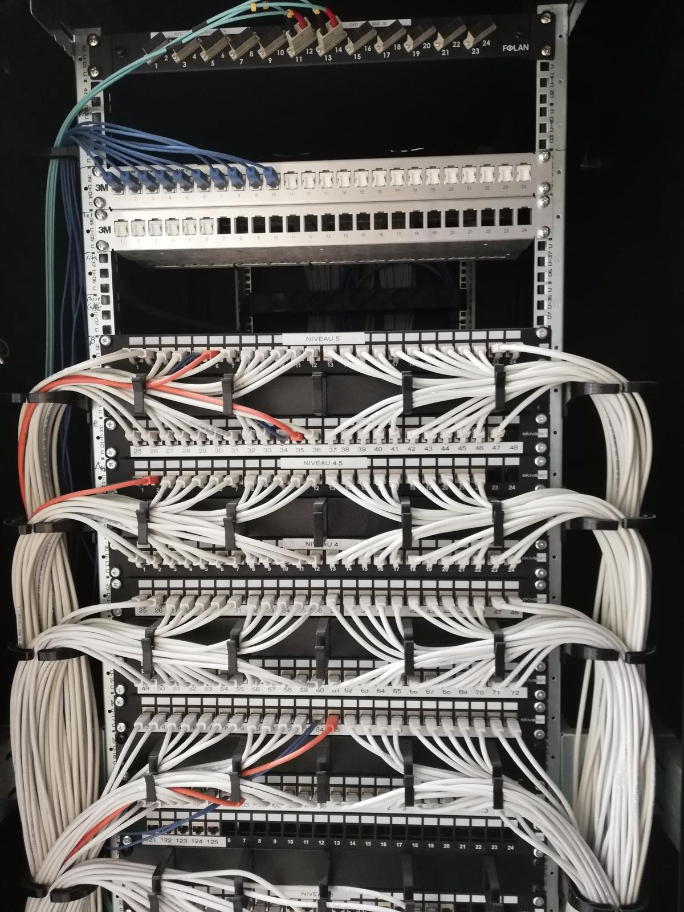
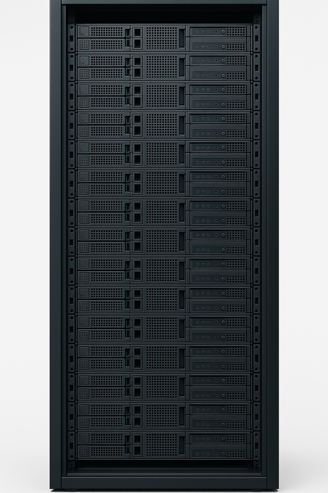

# E-117-Ex02-ELEMENTS-RESEAU

**Module :** ETML – Module 117

**Exercice :** 02

**Auteur :** Alexis Gugler

**Création :** 21.05.2025

**Version :** 1 du 21.05.2025

**Durée estimée :** 45-70 minutes

---

## 🧑‍🎓 Informations de l’élève

* **Nom :** `__________________________`
* **Prénom :** `__________________________`
* **Date :** `__________________________`

---

## 📌 Consignes générales

* **Nom du fichier à rendre :** `X-117-Ex02-nom-prenom.extension`
* **Lieu de dépôt :** Canal MS Teams, dans la section **Fichiers** du cours, selon les consignes de l’enseignant.
* **Formats acceptés :** `.DOCX`, `.PDF`, `.VSDX`, `.PNG`, `.JPG`
* **Date limite de rendu :** Dans 45 minutes

---

## 🎯 Objectif

À l’issue de cet exercice, vous serez capable d’identifier, de distinguer et de décrire les principaux éléments physiques d’un réseau informatique (passage de câbles, supports, armoires, etc.), d’expliquer leur rôle et leur usage dans différents contextes d’installation.

---

## 🛠️ Directives de travail

### Marche à suivre

Vous disposez de **45 minutes** pour lire et compléter les définitions manquantes pour les thèmes proposés ci-après.

Après ce laps de temps, la classe passera en revue les diverses propositions afin de permettre à chacun de compléter ses tableaux. Diverses précisions sont attendues pour chacun des thèmes et seront apportées lors d'une discussion commune.

---

               

## 🪛 Passage de câbles

Complétez le tableau ci-dessous. 

| Quoi ? | Définition | Image |
|--------|------------|-------|
| Conduit de câbles / Goulotte | `______________________________________________________________`   `______________________________________________________________`   `______________________________________________________________`   `______________________________________________________________` |  |
| Canal d’allège | Canal intégré au bâtiment, généralement horizontal, dans la partie inférieure des murs (souvent sous les fenêtres = allège), destiné à accueillir des câbles et prises. Encastré dans la maçonnerie ou intégré à la structure du mur. Peut contenir : câbles de courant fort/faible, prises réseau, prises électriques, etc. Utilisé dans les bureaux modernes, écoles, bâtiments tertiaires. |  |
| `______` | Structure métallique en forme de U ou de grille, généralement fixée au plafond ou sous un plancher technique, permettant de regrouper et de guider de nombreux câbles sur de longues distances.  |  |
| Faux-plancher / Faux-sol / Plancher technique | Plancher surélevé composé de dalles amovibles sous lesquelles passent les câbles, permettant une grande flexibilité pour l’ajout ou la modification de câblage dans les bureaux ou salles informatiques. |  |
| `______` | Systèmes verticaux de distribution de câbles, souvent utilisés dans les espaces ouverts ou modulables. Permettent d’acheminer l’alimentation et le réseau du sol au plafond, avec des versions de différentes hauteurs. |  |

> **Remarque :** L'architecture d'un bâtiment influence fortement les choix de passage de câbles pour l'installation d'un réseau informatique. Par exemple :
>
> - **Type de support de transmission :**
>     1. Câblage cuivre si la distance est inférieure à 100 m.
>     2. Fibre optique (souvent combinée à du cuivre) si la distance dépasse 100 m.
>     3. Ondes radio (Wi-Fi) si l’environnement est ouvert ou si les postes sont regroupés sans obstacles majeurs.
> - **Durée et coût d'installation** du support de transmission.
> - **Présence de plusieurs bâtiments** à relier.

---

   

## 🔌 Connexions physiques

Complétez le tableau ci-dessous. 

| Quoi ? | Définition | Image |
|--------|------------|-------|
| Armoire de brassage | Mobilier technique destiné à accueillir les équipements d’interconnexion réseau (panneaux de brassage, switchs, routeurs, etc.). Largeur standard : 19 pouces (~48,3 cm). |  |
| Armoire de serveurs | Armoire technique conçue pour héberger des serveurs informatiques et leurs équipements associés (alimentation, stockage, etc.). Plus profonde qu’une armoire de brassage. Largeur standard : 19 pouces. Exemple : ETML, A14 et/ou A24 |  |
| Éléments actifs | `______________________________________________________________`   `______________________________________________________________`   `______________________________________________________________`   `______________________________________________________________` |  |
| Supports de transmission | Supports physiques permettant le transport des signaux réseau : câbles en cuivre (paires torsadées, coaxial), fibres optiques (verre ou plastique), ou ondes électromagnétiques (Wi-Fi, radio). |  |
| Bande passante | Quantité maximale de données pouvant être transmise sur un support ou un réseau pendant un temps donné, généralement exprimée en bits par seconde (bps, Mbps, Gbps). |  |

 

> **Remarque :** La connexion physique des équipements influence l'installation d'un réseau informatique, notamment sur :
>
> - Le nombre de prises réseau nécessaires (clients connectés)
> - La charge supportée par les serveurs (nombre d’utilisateurs simultanés)
> - Les performances globales du réseau :
>     1. Débit disponible et partagé
>     2. Capacité de commutation des switchs
>     3. Capacité de routage des routeurs, notamment pour l’accès à Internet

---

   

## 🛡️ Sécurité

Complétez le tableau ci-dessous. 

| Quoi ? | Définition |
|--------|------------|
| Authentification | `______________________________________________________________`   `______________________________________________________________`   `______________________________________________________________`   `______________________________________________________________` |

Voici quelques éléments de sécurité à prendre en compte lors de l'installation d'un réseau informatique :
- **Sécurité physique** : accès aux locaux, protection des équipements, etc.
- **Sécurité logique** : protection des données, accès aux ressources, etc.
- **Sécurité réseau** : pare-feu, VPN, etc.

---
   

## 💾 Ressources autonomes et stockage

Complétez le tableau ci-dessous. 

| Quoi ? | Définition | Image |
|--------|------------|-------|
| Station de travail | `__________________________________________________________________________________________` |  |
| Serveur | Ordinateur central répondant aux besoins communs des utilisateurs avec ou sans domaine Active Directory (ADDS). Ex : Serveur de stockage, serveur Web, serveur E-mail, serveur FTP, etc. |  |
| Serveur autonome | `__________________________________________________________________________________________` |  |
| Architecture client/serveur | Désigne un mode de transaction à travers un réseau, entre plusieurs programmes ou processus : l'un, qualifié de client, envoie des requêtes ; l'autre, qualifié de serveur, attend les requêtes des clients et y répond. Le serveur offre ici un service au client. |  |
| Architecture poste à poste (Peer to Peer) | Les postes de travail sont juste reliés entre eux sur le réseau. Aucune machine ne joue un rôle spécifique et peut partager ses ressources avec toutes les autres. Chaque utilisateur est l’administrateur de son poste et définit les accès à ses propres ressources, stockage, imprimante, scanner, etc. |  |

**Précisez dans quels domaines les ressources partagées peuvent influencer l'installation d'un réseau informatique :**

`__________________________________________________________________________________________`

`__________________________________________________________________________________________`

`__________________________________________________________________________________________`

---

      

## 🖥️ Système(s) d’exploitation

Complétez le tableau ci-dessous. 

| Quoi ? | Définition |
|--------|------------|
| OS (Operating System) | `__________________________________________________________________________________________` |
| OS Server | Le système d’exploitation est une couche logicielle qui se situe entre le matériel et les applications. C’est le programme système fondamental qui contrôle les ressources de l’ordinateur. C’est le coordinateur des interactions entre ces couches et les utilisateurs. Ex : Windows Server, Ubuntu, Debian, CentOS… |

Le système peut influencer l'installation d'un réseau informatique selon :

- La nature des services supportés (messagerie, Web, stockage, backup, virtualisation, etc.)
- Le hardware supporté (quantité de mémoire vive, nombre de microprocesseurs, etc.)

---

## 🌐 Concepts et termes des réseaux informatiques

Complétez le tableau ci-dessous. 

| Quoi ? | Définition |
|--------|------------|
| Redondance | `__________________________________________________________________________________________` |
| Cluster | Regroupement de ressources d'un même genre qui apparaît comme une seule entité alors qu'elle est constituée de plusieurs. Ce concept est différent de la redondance, on l’appelle la Haute Disponibilité (HD). Ex : cluster de blocs, cluster de haute disponibilité (HD) : grappe d’ordinateurs qui assurent un service en évitant au maximum les indisponibilités. |
| Protocoles | Un protocole réseau est un « langage » normalisé et formaté qui garantit la communication entre des éléments d’un réseau informatique. Les protocoles sont actifs et hiérarchisés en « couches » selon le modèle de communication (TCP/IP, OSI, AppleTalk). Exemples de protocoles individuels : RS-232, ISDN, Ethernet, MAC, Token ring, ARP, IPX, SPX, TCP, UDP, FTP, SSH, http, https, IMAP, POP3, SMTP, Telnet. |
| Services | `__________________________________________________________________________________________` |
| Modèle en couches | `__________________________________________________________________________________________` |
| Cloud computing | L’informatique en « nuage » désigne un ensemble de processus qui utilisent la puissance de calcul et/ou de stockage de serveurs informatiques distants sur le réseau Internet. Ex : Microsoft Office 365, Azure, Google Drive, Apple iCloud, Dropbox, AWS, etc. |

**Précisez dans quels domaines les concepts "redondance" et "protocole" peuvent influencer l'installation d'un réseau informatique :**

`__________________________________________________________________________________________`

`__________________________________________________________________________________________`

`__________________________________________________________________________________________`

---
        
## 📚 Généralité

| Quoi ? | Définition |
|--------|------------|
| Réseau | C'est un moyen qui permet à des individus ou à des groupes dotés d'outils informatiques de partager des informations et des services. Ex : LAN, WAN, MAN, Internet, Intranet, Extranet |

**Trouvez une conclusion personnelle qui caractérise le mieux votre perception d'un réseau informatique et résumez-la ci-dessous :**

`__________________________________________________________________________________________`

`__________________________________________________________________________________________`

`__________________________________________________________________________________________`
`__________________________________________________________________________________________`

`__________________________________________________________________________________________`

`__________________________________________________________________________________________`
`__________________________________________________________________________________________`

`__________________________________________________________________________________________`

`__________________________________________________________________________________________`
`__________________________________________________________________________________________`

`__________________________________________________________________________________________`

`__________________________________________________________________________________________`

---

