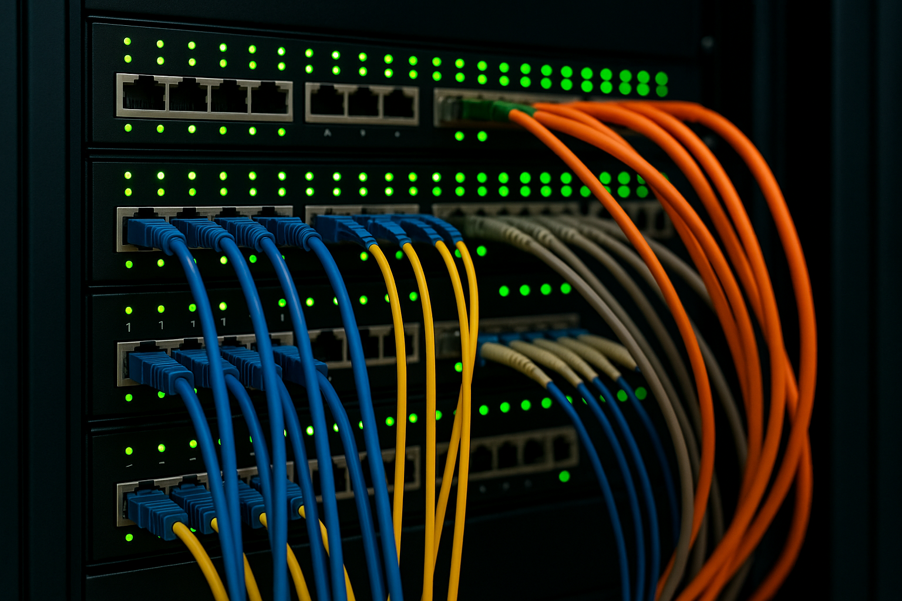

<!-- header: "I117 - Mettre en place l’infrastructure informatique et le réseau d’une petite entreprise" -->
# I117 - Mettre en place l’infrastructure informatique et le réseau d’une petite entreprise

---

## Module 117
**Compétence**
Installer un réseau local sans administration centralisée des utilisateurs.
**Objet**
Planification de l’installation d’un nouveau réseau local sans administration centralisée des utilisateurs comportant jusqu’à dix postes de travail avec connexion Internet, qui relie les ordinateurs et les imprimantes situés dans différents locaux d’un même bâtiment. Installation des composants réseau à partir de la prise LAN (ordinateur, imprimante locale).

---

## Objectifs opérationnels 
1. Recenser avec le mandant et consigner les exigences devant être remplies par le réseau à installer et déterminer les services souhaités (réseau Client, Internet, cloud).
2. Définir sur la base des exigences de l’entreprise et des conditions spatiales la construction logique et physique du réseau et la représenter sous la forme d’un diagramme de réseau et d’un plan de câblage.
3. Planifier les étapes de travail pour l’installation et la configuration qui tiennent compte du raccordement CUB (câblage universel du bâtiment) au terminal utilisateur et du brassage (patching) dans le rack de distribution central.
4. Installer le réseau et ses composants selon la documentation des constructeurs, procéder à la configuration.

---

## Objectifs opérationnels 
5. Définir la gestion des ressources (groupes, partages) et le partage des fichiers/imprimantes en respectant les prescriptions relatives à la sécurité des données et à la disponibilité.
6. Vérifier le fonctionnement, la performance, la sécurité du réseau et l’accès aux données des appareils périphériques connectés conformément aux consignes.
7. Tester le réseau et les systèmes connectés, documenter les résultats des tests.

---
<!-- header: "I117" -->
# Qu’est-ce qu’un réseau local ?

Également appelé LAN. => Local Area Network. 

---
# Exercice

Effectuez l’Exercice 00

**E-117-Ex00-LAN**

---
# Le réseau local (LAN)

- Un **réseau local** (LAN) est comme un club privé où plusieurs appareils, comme des ordinateurs, imprimantes, ou téléphones, peuvent **parler entre eux et échanger des informations**.
- **Local** signifie que tous ces appareils sont **proches les uns des autres**. Par exemple, dans une même maison, un bureau, ou une école.
- Le **réseau** est comme une **autoroute spéciale** qui permet à tous les appareils connectés de **partager** des choses comme des **fichiers**, des **imprimantes**, ou une **connexion Internet**.

---
# Le réseau local (LAN)
Imaginons : 
- Un **ordinateur**.
- Une **imprimante**.
- Un **routeur** (un peu comme un chef d'orchestre qui aide tout le monde à se parler).

Ces appareils sont reliés par des *câbles* ou des **ondes Wi-Fi** et ils peuvent **s'envoyer des messages** rapidement, sans quitter la maison ou le bureau.

---
## LAN vs WAN (=Internet)

### LAN = LOCAL AREA NETWORK
- C'est comme ta maison ou ton école.
Il connecte des appareils proches les uns des autres, comme des ordinateurs, imprimantes, et téléphones.
- Tout reste à l'intérieur : les informations circulent entre les appareils dans un même endroit.
- Souvent plus rapide et plus sécurisé, car c'est un petit réseau privé.

*Exemple :* Tu imprimes un fichier depuis ton ordinateur et sur une imprimante **dans la même salle**.

---
## LAN vs WAN (=Internet)

### WAN = WIDE AREA NETWORK
- C'est comme le monde entier.
- Il connecte des millions de réseaux locaux ensemble, partout dans le monde.
- Tout sort à l'extérieur : quand tu envoies un message, il voyage à travers des milliers de réseaux avant d'arriver à destination.
Plus lent que le LAN et moins sécurisé car tout le monde peut y accéder.

*Exemple :* Tu envoies un email à quelqu'un qui habite **dans un autre pays**.

---
# Internet - un brin d'histoire
- **Les débuts** : L'Internet a commencé dans les années 1960 avec un projet appelé ARPANET. Il a été créé par le gouvernement américain pour connecter des universités et des chercheurs afin qu'ils puissent échanger des informations.

- **L’évolution** : Dans les années 1980 et 1990, Internet s'est étendu à d'autres institutions et entreprises, permettant de connecter plusieurs réseaux ensemble. C'est à cette époque que le World Wide Web (le Web) a été inventé, rendant Internet accessible à tout le monde via des pages web.

---
# Internet - un brin d'histoire
- **Aujourd'hui** : Internet est devenu un réseau mondial reliant des millions d'ordinateurs, téléphones, et autres appareils. Il nous permet de communiquer, de partager des informations et d'accéder à du contenu partout dans le monde.

---
# Compétences
**Installer un réseau local sans administration centralisée des utilisateurs.**

Pour une PME de 10 machines avec imprimantes et potentiellement du cloud et/ou un NAS. 

---
# Contexte : notre fil rouge pour ce module
- Vous êtes mandatés par une StartUp de l’EPFL appelée «**ScaleFast**» afin de répondre à leurs besoins en matière d’informatique. 
- ScaleFast a obtenu des nouveaux locaux et ils pourront y emménager dans 2 mois. 
- Afin que tout se passe au mieux ils vous ont mandatés pour préparer leur réseau informatique, leur accès à internet et vous ont fourni un plan de leurs nouveaux locaux ainsi qu’une liste de matériel qu’ils souhaitent acquérir et interconnecter. 

---
# Exercice

Effectuez l’Exercice 01

**E-117-Ex01-COMPOSANTS**

---
# Composants d’un réseau
Qu’est-ce qui compose un réseau ? Quels sont les composants d’un réseau LAN ? 

---

---
## ScaleFast - accès à Internet
ScaleFast a besoin d’accéder à Internet. 

=> Comment procédez-vous ? 

--- 
## ScaleFast - accès à Internet

=> UNE BOX . Mais c’est quoi une Box ? 
- La BOX, c'est un appareil « presque » magique qui te permet de te connecter à Internet et de partager cette connexion avec tous les appareils dans ta maison (ordinateurs, téléphones, consoles de jeux, etc.).
- Mais pour les informaticiens que nous sommes, ce n’est pas si « magique » , c’est en réalité un appareil 3 en 1 qui contient « Un modem, un Router et un Access Point » .

---

## Modem, Router & AP - Les 3 parties importantes d'une Box
**Modem**
Il communique avec ton fournisseur d’accès à Internet (FAI) ! Le modem convertit le signal fourni par ton FAI (via câble, fibre, ADSL, etc.) en un signal numérique que tes appareils peuvent comprendre et utiliser pour se connecter à Internet. 

*Exemple : il transforme l’Internet qui arrive de l'extérieur en quelque chose que tes appareils (ordinateurs, smartphones) peuvent utiliser.*

---

## Modem, Router & AP - Les 3 parties importantes d'une Box
**Router**
Le cerveau du réseau !
Le routeur gère et distribue la connexion Internet entre tous les appareils de ton réseau local (LAN). Il attribue des adresses IP à chaque appareil, assure que les données sont envoyées au bon destinataire, et contrôle la circulation des informations entre ton réseau local et Internet. 

*Exemple : il décide quel appareil reçoit quelle partie d’Internet et organise les échanges de données.*

---

## Modem, Router & AP - Les 3 parties importantes d'une Box
**Access Point (Point d'accès)**

Il diffuse le Wi-Fi 
Le point d’accès Wi-Fi permet à tes appareils sans fil (ordinateurs portables, smartphones, tablettes) de se connecter au réseau local sans utiliser de câbles. Il convertit le signal du routeur en signal Wi-Fi, créant un réseau sans fil dans ta maison.

*Exemple : il te permet d'accéder à Internet sans fil depuis n’importe quel appareil compatible Wi-Fi.*

---

## Le Modem : Le lien entre le réseau local et Internet
**Fonction du Modem**
- Le **modem** (abréviation de **modulateur-démodulateur**) sert d’interface entre ton réseau local (**LAN**) et le réseau de ton fournisseur d’accès à Internet (**FAI**).
- Il convertit les signaux numériques provenant de tes équipements en signaux compatibles avec l’infrastructure du FAI (ligne téléphonique, câble coaxial, fibre optique…)

**Comment ça marche ?**
- **Modulation** : Il transforme (il module) les données numériques de ton réseau en signaux analogiques ou optiques pour les envoyer via l'infrastructure du FAI.
- **Démodulation** : Il reconvertit les signaux entrants du FAI en données numériques pour ton réseau local.

---
## Le Routeur : Le cerveau du réseau
**Fonction du Routeur**
- Le **routeur** est un dispositif réseau qui **dirige le trafic** entre différents réseaux. Souvent le modem et le routeur sont intégrés dans un même appareil et dans ce cas, Il assure également la communication entre ton **réseau local (LAN)** et des réseaux externes, comme **Internet**.
- Il gère le **routage des paquets de données** : il décide quel chemin chaque paquet doit emprunter pour atteindre sa destination, que ce soit vers un appareil de ton réseau ou vers l'extérieur.

---
## Le Routeur : Le cerveau du réseau
**Comment ça marche ?**
- **Attribution des adresses IP locales :**
Le routeur attribue des **adresses IP privées** uniques à chaque appareil dans le réseau local via un serveur **DHCP** intégré. Chaque appareil reçoit une adresse pour pouvoir communiquer dans le LAN.
- **Routage des paquets :**
Lorsqu’un appareil de ton réseau envoie des données, le routeur les analyse et **détermine la meilleure route** pour ces paquets. S’ils sont destinés à un appareil sur le LAN, il les envoie directement. Si les paquets doivent sortir vers Internet, le routeur les transmet via le modem.
- **NAT (Network Address Translation) :**
Le routeur utilise le **NAT** pour convertir les **adresses IP privées** de ton réseau local en une **adresse IP publique**. Cette adresse publique est celle fournie par ton FAI. Le NAT permet à tous les appareils de ton LAN de partager une seule IP publique lorsqu'ils communiquent avec l'Internet.

---
## Le Routeur : Le cerveau du réseau
**Fonctions principales du Routeur**
- **Routage** : Gère et dirige le trafic réseau en fonction des adresses IP des paquets de données.
- **Pare-feu** basique : Filtre les paquets entrants et sortants pour protéger le réseau local des menaces extérieures.
- **DHCP** : Attribue automatiquement des adresses IP aux appareils du réseau local.
- **NAT** : Permet à plusieurs appareils de ton réseau local d’utiliser une seule adresse IP publique pour accéder à Internet.

---
## L'Access Point (Point d’accès Wi-Fi) : Le diffuseur du réseau sans fil

<!-- _columns: 2 -->

**Fonction de l'Access Point** 
- Un **Access Point (Point d’accès Wi-Fi)** est un dispositif qui permet de **connecter des appareils sans fil** (comme les ordinateurs portables, smartphones, tablettes) à un réseau local (LAN). Il convertit les données reçues du réseau câblé (LAN) en **signaux radio** que les appareils sans fil peuvent recevoir, et vice versa. 
- Contrairement au **modem** ou au **routeur**, l'Access Point ne gère pas l’accès à Internet directement, mais sert de pont entre le réseau câblé et les appareils Wi-Fi.

Source image : <a href="https://www.ui.com/" target="_blank">Ubiquiti</a>

---
## L'Access Point (Point d’accès Wi-Fi) : Le diffuseur du réseau sans fil
**Comment ça marche ?**
- **Connexion au réseau local :**
L’Access Point est connecté à un **switch ou un routeur** via un câble Ethernet. Il fait partie du réseau local filaire.
- **Diffusion du Wi-Fi :**
Il émet un **signal Wi-Fi** que les appareils sans fil à proximité peuvent capter. Les appareils, tels que les téléphones ou ordinateurs portables, se connectent alors à ce signal pour accéder au réseau local (LAN) et, via le routeur, à Internet.
- **Transmission de données :**
Quand un appareil envoie des données via Wi-Fi (ex. : ouvrir un site web), l'Access Point les **retransmet** via le réseau câblé vers le routeur ou le switch, qui les dirige ensuite vers leur destination. Dans l'autre sens, il transforme les données du réseau câblé en signaux sans fil.

---
## Le Répéteur
**Définition** : 
Un répéteur est un appareil réseau qui **amplifie** ou **retransmet** les signaux pour étendre la portée d'une transmission sur un réseau. Il est souvent utilisé dans les réseaux câblés ou sans fil pour renforcer un signal affaibli après une longue distance.

**Fonction principale** : Le répéteur reçoit un signal, le régénère, et l'envoie plus loin pour compenser la perte de signal due à la distance.

**Utilisation** : Très utile pour étendre la couverture des réseaux sans fil (Wi-Fi) ou augmenter la distance de transmission dans les réseaux câblés.
 

---
## Le Switch
**Fonction du Switch**
- Le **Switch** est un dispositif réseau qui connecte plusieurs appareils (clients, serveurs, imprimantes) au sein d’un **réseau local (LAN)**. Il permet à ces appareils de communiquer **entre eux** de manière efficace.
- Le rôle principal du switch est de **diriger intelligemment** les données entre les appareils connectés à lui, en envoyant les informations **uniquement à l’appareil destinataire**.
 Source image : <a href="https://www.ui.com/" target="_blank">Ubiquiti</a>

---
## Le Switch
**Comment ça marche ?**
- **Connexion des appareils** :
Tous les appareils du réseau local (ordinateurs, imprimantes, serveurs) sont **branchés sur le switch** via des câbles Ethernet. Chaque appareil dispose d'une **adresse MAC unique** (adresse physique attribuée par le fabricant) que le switch utilise pour identifier les appareils.
- **Transmission des données** :
Lorsque l'un des appareils envoie des données à un autre appareil du réseau, le switch **lit l’adresse MAC de destination** et **envoie les données** uniquement à l’appareil concerné. Cela permet une communication rapide et évite que les données ne soient envoyées à tous les appareils (comme le ferait un hub).
- **Amélioration du réseau** :
Le switch améliore la performance du réseau en **réduisant les collisions de données** et en permettant des communications simultanées entre plusieurs appareils sans interférence.

---
## Le Hub
**Fonction du Hub**
- Le **Hub** est un dispositif réseau qui permet de connecter plusieurs appareils (ordinateurs, imprimantes, etc.) dans un réseau local (**LAN**).
- Contrairement au switch, le hub ne sait pas diriger intelligemment les données. Il envoie les informations à **tous les appareils connectés**, qu’ils en soient les destinataires ou non.

---
## Le Hub
**Comment ça marche ?**
- **Connexion des appareils** :
  Tous les appareils (PC, imprimantes, etc.) sont branchés sur le hub via des câbles Ethernet. Ils partagent tous le même lien physique.
- **Transmission des données** :
  Lorsqu'un appareil envoie des données, le hub copie ces données et les envoie à **tous les appareils connectés**. L'appareil destinataire reconnaît les données qui lui sont adressées et les traite, tandis que les autres appareils ignorent ces données.
- **Collision des données** :
  Comme le hub ne différencie pas les destinataires, plusieurs appareils peuvent envoyer des données en même temps, ce qui peut provoquer des **collisions**. Cela ralentit le réseau, car les appareils doivent attendre leur tour pour renvoyer les données.

---
## Élément actif (⚠️ important à connaître)

Un **élément actif** du réseau désigne tout appareil ou composant qui nécessite une alimentation électrique pour fonctionner et qui participe activement à la gestion ou au routage du trafic réseau. Ces éléments peuvent traiter, amplifier ou régénérer les signaux pour garantir le bon fonctionnement du réseau.

**Exemples d'éléments actifs :**
- **Routeurs** : dirigent les paquets de données entre différents réseaux.
- **Switches** : gèrent le trafic entre les appareils d'un réseau local.
- **Points d’accès Wi-Fi** : permettent la communication sans fil entre les appareils et le réseau.
- **Modems** : convertissent les signaux numériques en signaux analogiques et vice versa.

Ces appareils, contrairement aux **éléments passifs** (comme les câbles ou les connecteurs), jouent un rôle **actif** dans le contrôle et la gestion du réseau.

---
## Élément passif (⚠️ important à connaître)
 Les éléments **passifs** n'ont pas besoin d'alimentation électrique pour fonctionner. Ils ne traitent ni ne modifient activement les signaux qui circulent à travers eux ; leur rôle est simplement de permettre la transmission des données sans les altérer.
**Exemples d'éléments passifs :**
- **Câbles réseau** : comme les câbles Ethernet, qui transportent les données entre les appareils.
- **Panneaux de brassage** : qui organisent et distribuent les connexions réseau dans un local technique.
- **Prises murales** : qui permettent de connecter les câbles réseau aux appareils dans les bureaux ou les salles.
Ces éléments sont essentiels pour établir une infrastructure réseau, mais ils ne participent pas activement à la gestion du trafic ou à la communication entre les appareils.

---
# Exercice
Effectuez l’Exercice 02
**E-117-Ex02-ElementsReseau**

---
# Devoirs
**Devoirs : Qu’est-ce qu’une gateway ?**

Préparer un petit PowerPoint et le déposer sur MS Teams.

Une personne sera tirée au sort la semaine prochaine. Si réussite, alors toute la classe gagne 1 point bonus au prochain test. 

---
# Les Câbles Réseaux et la Fibre

**Câbles Ethernet (Cuivre) – Twisted Pair**
- **UTP (Unshielded Twisted Pair)** : câble non blindé, débit dépend de la catégorie, jusqu'à 100m max.
- **STP (Shielded Twisted Pair)** : câble blindé pour réduire les interférences.
- **Catégories** :
  - Cat 5e & 6 : jusqu'à 1 Gbps (Cat 6 peut atteindre 10 Gbps sur 55m max)
  - Cat 6A : jusqu'à 10 Gbps sur 100m
  - Cat 7, 7A : jusqu'à 10 Gbps, toujours blindé
  - Cat 8.1 & 8.2 : jusqu'à 25/40 Gbps sur 30m max
- **Câble Plenum** : ignifuge, limite la propagation des flammes (utilisé dans les faux plafonds/planchers).

---
## Les Câbles Réseaux et la Fibre

**Câble Coaxial**
- Utilisé pour la télévision par câble et certains réseaux Internet câblés.
- Très rare dans les réseaux locaux modernes.

**Fibre Optique**
- Utilisée pour les réseaux longue distance et haut débit (FAI, entreprises, foyers).
- Peut couvrir plusieurs kilomètres sans perte de signal.
- **Types :**
  - **Monomode** : très longues distances (jusqu’à 100 km avec équipements adaptés)
  - **Multimode** : distances moyennes (en pratique 300 à 550m à 10 Gbps selon la fibre, jusqu’à 2 km à faible débit, utilisé dans les réseaux locaux à haute vitesse comme les datacenters)

---
# Normes Ethernet

Les normes Ethernet définissent les caractéristiques et les spécifications des réseaux Ethernet, y compris la vitesse de transmission, le type de câblage utilisé, et les distances maximales supportées. Elles sont développées et régulées par **l'IEEE (Institute of Electrical and Electronics Engineers)** sous la norme **IEEE 802.3**. 

Source image : <a href="https://learningnetwork.cisco.com/servlet/rtaImage?eid=ka06e000000dNq0&feoid=00N3i00000D6DDX&refid=0EM6e000005DtZG" target="_blank">Cisco Learning</a> Source article : <a href="https://learningnetwork.cisco.com/s/article/Fundamentos-del-cableado-ethernet-en-una-red-de-datos-empresarial" target="_blank">Cisco Learning</a>

---
# Normes Wi-Fi

Les normes Wi-Fi définissent les caractéristiques et les spécifications des réseaux sans fil, notamment la vitesse de transmission, la bande de fréquence utilisée, et la portée maximale. Elles sont développées et régulées par **l'IEEE (Institute of Electrical and Electronics Engineers)** sous **la norme IEEE 802.11**. Chaque révision de cette norme (802.11a, 802.11n, 802.11ax, etc.) introduit des améliorations en termes de vitesse, portée, sécurité et gestion des interférences, tout en restant compatible avec les versions précédentes.

Source image : <a href="https://static-community.tp-link.com/other/19/4/2019/2f2c298dd8404a8db70c294e3dfe5d1b.jpg" target="_blank">Cisco Learning</a> Source article : <a href="https://www.tp-link.com/fr/support/faq/2436/" target="_blank">Cisco Learning</a>

---
# Exercice
Effectuez l’Exercice 03
**E-117-Ex03-SupportsTransmission**

---

# Sources

## Images
Si une image n'a pas de sources mentionnées, c'est qu'elle a été soit générée par IA (merci chatgpt.com), soit qu'elle a été créée par moi ou un collègue, soit qu'elle est libre de droit sans attribution, et enfin dernière option, l'auteur n'est pas connu*.

> *Parfois l'auteur n'a pas été retrouvé lorsque l'image provient d'un ancien support de cours. 

Toutes les autres images ont leurs sources mentionnées directement au dessus ou en bas de l'image.