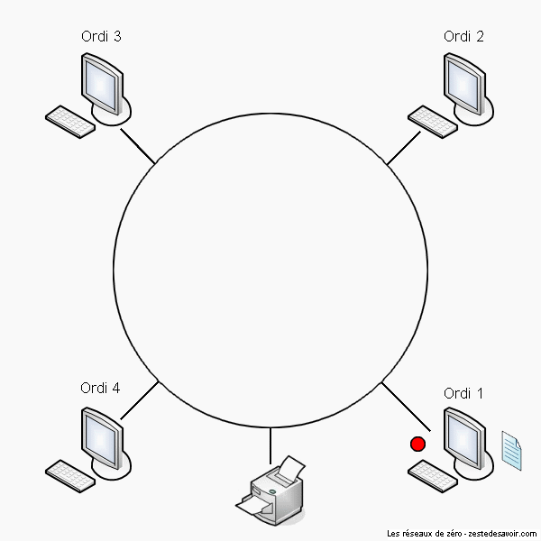
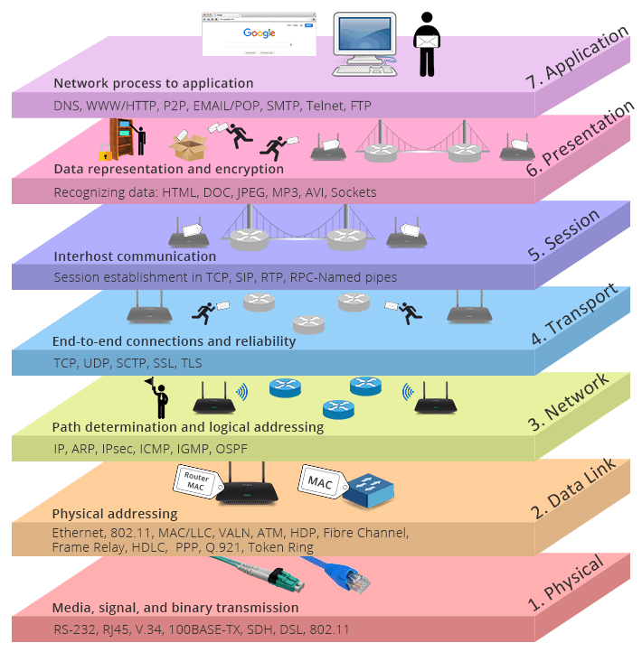
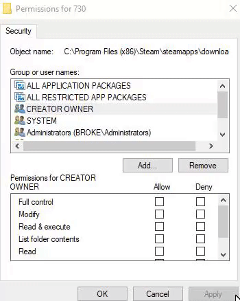

<!-- header: "I117 - Mettre en place l’infrastructure informatique et le réseau d’une petite entreprise" -->
# I117 - Mettre en place l’infrastructure informatique et le réseau d’une petite entreprise

---

## Module 117
**Compétence**
Installer un réseau local sans administration centralisée des utilisateurs.
**Objet**
Planification de l’installation d’un nouveau réseau local sans administration centralisée des utilisateurs comportant jusqu’à dix postes de travail avec connexion Internet, qui relie les ordinateurs et les imprimantes situés dans différents locaux d’un même bâtiment. Installation des composants réseau à partir de la prise LAN (ordinateur, imprimante locale).

---

## Objectifs opérationnels 
1. Recenser avec le mandant et consigner les exigences devant être remplies par le réseau à installer et déterminer les services souhaités (réseau Client, Internet, cloud).
2. Définir sur la base des exigences de l’entreprise et des conditions spatiales la construction logique et physique du réseau et la représenter sous la forme d’un diagramme de réseau et d’un plan de câblage.
3. Planifier les étapes de travail pour l’installation et la configuration qui tiennent compte du raccordement CUB (câblage universel du bâtiment) au terminal utilisateur et du brassage (patching) dans le rack de distribution central.
4. Installer le réseau et ses composants selon la documentation des constructeurs, procéder à la configuration.

---

## Objectifs opérationnels 
5. Définir la gestion des ressources (groupes, partages) et le partage des fichiers/imprimantes en respectant les prescriptions relatives à la sécurité des données et à la disponibilité.
6. Vérifier le fonctionnement, la performance, la sécurité du réseau et l’accès aux données des appareils périphériques connectés conformément aux consignes.
7. Tester le réseau et les systèmes connectés, documenter les résultats des tests.

---
<!-- header: "I117" -->
# Qu’est-ce qu’un réseau local ?

Également appelé LAN. => Local Area Network. 

---
# Exercice

Effectuez l’Exercice 00

**E-117-Ex00-LAN**

---
# Le réseau local (LAN)

- Un **réseau local** (LAN) est comme un club privé où plusieurs appareils, comme des ordinateurs, imprimantes, ou téléphones, peuvent **parler entre eux et échanger des informations**.
- **Local** signifie que tous ces appareils sont **proches les uns des autres**. Par exemple, dans une même maison, un bureau, ou une école.
- Le **réseau** est comme une **autoroute spéciale** qui permet à tous les appareils connectés de **partager** des choses comme des **fichiers**, des **imprimantes**, ou une **connexion Internet**.

---
# Le réseau local (LAN)
Imaginons : 
- Un **ordinateur**.
- Une **imprimante**.
- Un **routeur** (un peu comme un chef d'orchestre qui aide tout le monde à se parler).

Ces appareils sont reliés par des *câbles* ou des **ondes Wi-Fi** et ils peuvent **s'envoyer des messages** rapidement, sans quitter la maison ou le bureau.

---
## LAN vs WAN (=Internet)

### LAN = LOCAL AREA NETWORK
- C'est comme ta maison ou ton école.
Il connecte des appareils proches les uns des autres, comme des ordinateurs, imprimantes, et téléphones.
- Tout reste à l'intérieur : les informations circulent entre les appareils dans un même endroit.
- Souvent plus rapide et plus sécurisé, car c'est un petit réseau privé.

*Exemple :* Tu imprimes un fichier depuis ton ordinateur et sur une imprimante **dans la même salle**.

---
## LAN vs WAN (=Internet)

### WAN = WIDE AREA NETWORK
- C'est comme le monde entier.
- Il connecte des millions de réseaux locaux ensemble, partout dans le monde.
- Tout sort à l'extérieur : quand tu envoies un message, il voyage à travers des milliers de réseaux avant d'arriver à destination.
Plus lent que le LAN et moins sécurisé car tout le monde peut y accéder.

*Exemple :* Tu envoies un email à quelqu'un qui habite **dans un autre pays**.

---
# Internet - un brin d'histoire
- **Les débuts** : L'Internet a commencé dans les années 1960 avec un projet appelé ARPANET. Il a été créé par le gouvernement américain pour connecter des universités et des chercheurs afin qu'ils puissent échanger des informations.

- **L’évolution** : Dans les années 1980 et 1990, Internet s'est étendu à d'autres institutions et entreprises, permettant de connecter plusieurs réseaux ensemble. C'est à cette époque que le World Wide Web (le Web) a été inventé, rendant Internet accessible à tout le monde via des pages web.

---
# Internet - un brin d'histoire
- **Aujourd'hui** : Internet est devenu un réseau mondial reliant des millions d'ordinateurs, téléphones, et autres appareils. Il nous permet de communiquer, de partager des informations et d'accéder à du contenu partout dans le monde.

---
# Compétences
**Installer un réseau local sans administration centralisée des utilisateurs.**

Pour une PME de 10 machines avec imprimantes et potentiellement du cloud et/ou un NAS. 

---
# Contexte : notre fil rouge pour ce module
- Vous êtes mandatés par une StartUp de l’EPFL appelée «**ScaleFast**» afin de répondre à leurs besoins en matière d’informatique. 
- ScaleFast a obtenu des nouveaux locaux et ils pourront y emménager dans 2 mois. 
- Afin que tout se passe au mieux ils vous ont mandatés pour préparer leur réseau informatique, leur accès à internet et vous ont fourni un plan de leurs nouveaux locaux ainsi qu’une liste de matériel qu’ils souhaitent acquérir et interconnecter. 

---
# Exercice

Effectuez l’Exercice 01

**E-117-Ex01-COMPOSANTS**

---
# Composants d’un réseau
Qu’est-ce qui compose un réseau ? Quels sont les composants d’un réseau LAN ? 

---

---
## ScaleFast - accès à Internet
ScaleFast a besoin d’accéder à Internet. 

=> Comment procédez-vous ? 

--- 
## ScaleFast - accès à Internet

=> UNE BOX . Mais c’est quoi une Box ? 
- La BOX, c'est un appareil « presque » magique qui te permet de te connecter à Internet et de partager cette connexion avec tous les appareils dans ta maison (ordinateurs, téléphones, consoles de jeux, etc.).
- Mais pour les informaticiens que nous sommes, ce n’est pas si « magique » , c’est en réalité un appareil 3 en 1 qui contient « Un modem, un Router et un Access Point ».

---

## Modem, Router & AP - Les 3 parties importantes d'une Box
**Modem**
Il communique avec ton fournisseur d’accès à Internet (FAI) ! Le modem convertit le signal fourni par ton FAI (via câble, fibre, ADSL, etc.) en un signal numérique que tes appareils peuvent comprendre et utiliser pour se connecter à Internet. 

*Exemple : il transforme l’Internet qui arrive de l'extérieur en quelque chose que tes appareils (ordinateurs, smartphones) peuvent utiliser.*

---

## Modem, Router & AP - Les 3 parties importantes d'une Box
**Router**
Le cerveau du réseau !
Le routeur gère et distribue la connexion Internet entre tous les appareils de ton réseau local (LAN). Il attribue des adresses IP à chaque appareil, assure que les données sont envoyées au bon destinataire, et contrôle la circulation des informations entre ton réseau local et Internet. 

*Exemple : il décide quel appareil reçoit quelle partie d’Internet et organise les échanges de données.*

---

## Modem, Router & AP - Les 3 parties importantes d'une Box
**Access Point (Point d'accès)**

Il diffuse le Wi-Fi 
Le point d’accès Wi-Fi permet à tes appareils sans fil (ordinateurs portables, smartphones, tablettes) de se connecter au réseau local sans utiliser de câbles. Il convertit le signal du routeur en signal Wi-Fi, créant un réseau sans fil dans ta maison.

*Exemple : il te permet d'accéder à Internet sans fil depuis n’importe quel appareil compatible Wi-Fi.*

---

## Le Modem : Le lien entre le réseau local et Internet
**Fonction du Modem**
- Le **modem** (abréviation de **modulateur-démodulateur**) sert d’interface entre ton réseau local (**LAN**) et le réseau de ton fournisseur d’accès à Internet (**FAI**).
- Il convertit les signaux numériques provenant de tes équipements en signaux compatibles avec l’infrastructure du FAI (ligne téléphonique, câble coaxial, fibre optique…)

**Comment ça marche ?**
- **Modulation** : Il transforme (il module) les données numériques de ton réseau en signaux analogiques ou optiques pour les envoyer via l'infrastructure du FAI.
- **Démodulation** : Il reconvertit les signaux entrants du FAI en données numériques pour ton réseau local.

---
## Le Routeur : Le cerveau du réseau
**Fonction du Routeur**
- Le **routeur** est un dispositif réseau qui **dirige le trafic** entre différents réseaux. Souvent le modem et le routeur sont intégrés dans un même appareil et dans ce cas, Il assure également la communication entre ton **réseau local (LAN)** et des réseaux externes, comme **Internet**.
- Il gère le **routage des paquets de données** : il décide quel chemin chaque paquet doit emprunter pour atteindre sa destination, que ce soit vers un appareil de ton réseau ou vers l'extérieur.

---
## Le Routeur : Le cerveau du réseau
**Comment ça marche ?**
- **Attribution des adresses IP locales :**
Le routeur attribue des **adresses IP privées** uniques à chaque appareil dans le réseau local via un serveur **DHCP** intégré. Chaque appareil reçoit une adresse pour pouvoir communiquer dans le LAN.
- **Routage des paquets :**
Lorsqu’un appareil de ton réseau envoie des données, le routeur les analyse et **détermine la meilleure route** pour ces paquets. S’ils sont destinés à un appareil sur le LAN, il les envoie directement. Si les paquets doivent sortir vers Internet, le routeur les transmet via le modem.

---
## Le Routeur : Le cerveau du réseau
**Comment ça marche ?**

- **NAT (Network Address Translation) :**
Le routeur utilise le **NAT** pour convertir les **adresses IP privées** de ton réseau local en une **adresse IP publique**. Cette adresse publique est celle fournie par ton FAI. Le NAT permet à tous les appareils de ton LAN de partager une seule IP publique lorsqu'ils communiquent avec l'Internet.

---
## Le Routeur : Le cerveau du réseau
**Fonctions principales du Routeur**
- **Routage** : Gère et dirige le trafic réseau en fonction des adresses IP des paquets de données.
- **Pare-feu** basique : Filtre les paquets entrants et sortants pour protéger le réseau local des menaces extérieures.
- **DHCP** : Attribue automatiquement des adresses IP aux appareils du réseau local.
- **NAT** : Permet à plusieurs appareils de ton réseau local d’utiliser une seule adresse IP publique pour accéder à Internet.

---
## L'Access Point (Point d’accès Wi-Fi) : Le diffuseur du réseau sans fil

**Fonction de l'Access Point**
- Un **Access Point (Point d’accès Wi-Fi)** permet à des appareils sans fil (ordinateurs portables, smartphones, tablettes) de se connecter au réseau local (LAN) via le Wi-Fi.
- Il fait le lien entre le réseau câblé et les appareils Wi-Fi, mais ne gère pas directement l’accès à Internet comme un modem ou un routeur.

Source image : <a href="https://www.ui.com/" target="_blank">Ubiquiti</a>

---
## L'Access Point (Point d’accès Wi-Fi) : Le diffuseur du réseau sans fil
**Comment ça marche ?**
- **L’Access Point** est relié au réseau local (switch ou routeur) par un câble Ethernet.
- Il diffuse un **signal Wi-Fi** auquel les appareils sans fil se connectent pour accéder au réseau et à Internet. (smartphones, tablettes, ordinateurs portables, etc.)
- Les données échangées passent par l’Access Point, qui fait le lien entre le Wi-Fi et le réseau câblé.

---
## Le Répéteur
**Définition** : 
Un répéteur est un appareil réseau qui **amplifie** ou **retransmet** les signaux pour étendre la portée d'une transmission sur un réseau. Il est souvent utilisé dans les réseaux câblés ou sans fil pour renforcer un signal affaibli après une longue distance.

**Fonction principale** : Le répéteur reçoit un signal, le régénère, et l'envoie plus loin pour compenser la perte de signal due à la distance.

**Utilisation** : Très utile pour étendre la couverture des réseaux sans fil (Wi-Fi) ou augmenter la distance de transmission dans les réseaux câblés.
 

---
## Le Switch
**Fonction du Switch**
- Le **Switch** est un dispositif réseau qui connecte plusieurs appareils (clients, serveurs, imprimantes) au sein d’un **réseau local (LAN)**. Il permet à ces appareils de communiquer **entre eux** de manière efficace.
- Le rôle principal du switch est de **diriger intelligemment** les données entre les appareils connectés à lui, en envoyant les informations **uniquement à l’appareil destinataire**.
 Source image : <a href="https://www.ui.com/" target="_blank">Ubiquiti</a>

---
## Le Switch
**Comment ça marche ?**
- **Connexion des appareils** :
Tous les appareils du réseau local (ordinateurs, imprimantes, serveurs) sont **branchés sur le switch** via des câbles Ethernet. Chaque appareil dispose d'une **adresse MAC unique** (adresse physique attribuée par le fabricant) que le switch utilise pour identifier les appareils.
- **Transmission des données** :
Lorsque l'un des appareils envoie des données à un autre appareil du réseau, le switch **lit l’adresse MAC de destination** et **envoie les données** uniquement à l’appareil concerné. Cela permet une communication rapide et évite que les données ne soient envoyées à tous les appareils (comme le ferait un hub).

---
## Le Switch
**Comment ça marche ?**

- **Amélioration du réseau** :
Le switch améliore la performance du réseau en **réduisant les collisions de données** et en permettant des communications simultanées entre plusieurs appareils sans interférence.

---
## Le Hub
**Fonction du Hub**
- Le **Hub** est un dispositif réseau qui permet de connecter plusieurs appareils (ordinateurs, imprimantes, etc.) dans un réseau local (**LAN**).
- Contrairement au switch, le hub ne sait pas diriger intelligemment les données. Il envoie les informations à **tous les appareils connectés**, qu’ils en soient les destinataires ou non.

---
## Le Hub
**Comment ça marche ?**
- **Connexion des appareils** : Tous les appareils sont branchés via câbles RJ45. 
- **Transmission des données** :
  Lorsqu'un appareil envoie des données, le hub copie ces données et les envoie à **tous les appareils connectés**. L'appareil destinataire reconnaît les données qui lui sont adressées et les traite, tandis que les autres appareils ignorent ces données.
- **Collision des données** :
  Comme le hub ne différencie pas les destinataires, plusieurs appareils peuvent envoyer des données en même temps, ce qui peut provoquer des **collisions**. Cela ralentit le réseau, car les appareils doivent attendre leur tour pour renvoyer les données.

---
## Élément actif (⚠️ important à connaître)

Un **élément actif** du réseau désigne tout appareil ou composant qui nécessite une alimentation électrique pour fonctionner et qui participe activement (actif) à la gestion ou au routage du trafic réseau. Ces éléments peuvent traiter, amplifier ou régénérer les signaux pour garantir le bon fonctionnement du réseau.

**Exemples d'éléments actifs :**
- **Routeurs** : dirigent les paquets de données entre différents réseaux.
- **Switches** : gèrent le trafic entre les appareils d'un réseau local.
- **Points d’accès Wi-Fi** : permettent la communication sans fil entre les appareils et le réseau.
- **Modems** : convertissent les signaux numériques en signaux analogiques et vice versa.

---
## Élément passif (⚠️ important à connaître)
 Les éléments **passifs** n'ont pas besoin d'alimentation électrique pour fonctionner. Ils ne traitent ni ne modifient activement les signaux qui circulent à travers eux ; leur rôle est simplement de permettre la transmission des données sans les altérer. Ces éléments ne participent pas à la gestion du trafic réseau.
**Exemples d'éléments passifs :**
- **Câbles réseau** : comme les câbles Ethernet, qui transportent les données entre les appareils.
- **Panneaux de brassage** : qui organisent et distribuent les connexions réseau dans un local technique.
- **Prises murales** : qui permettent de connecter les câbles réseau aux appareils dans les bureaux ou les salles.

---
# Exercice
Effectuez l’Exercice 02
**E-117-Ex02-ElementsReseau**

---
# Devoirs
**Devoirs : Qu’est-ce qu’une gateway ?**

Préparer un petit PowerPoint et le déposer sur MS Teams.

Une personne sera tirée au sort la semaine prochaine. Si réussite, alors toute la classe gagne 1 point bonus au prochain test. 

---
# Les Câbles Réseaux et la Fibre

**Câbles Ethernet (Cuivre) – Twisted Pair**
**UTP (Unshielded Twisted Pair)** : câble non blindé, débit dépend de la catégorie, jusqu'à 100m max.
**STP (Shielded Twisted Pair)** : câble blindé pour réduire les interférences.
- **Catégories** :
  - Cat 5e & 6 : jusqu'à 1 Gbps (Cat 6 peut atteindre 10 Gbps sur 55m max)
  - Cat 6A : jusqu'à 10 Gbps sur 100m
  - Cat 7, 7A : jusqu'à 10 Gbps, toujours blindé
  - Cat 8.1 & 8.2 : jusqu'à 25/40 Gbps sur 30m max
- **Câble Plenum** : ignifuge, limite la propagation des flammes (utilisé dans les faux plafonds/planchers).

---
## Les Câbles Réseaux et la Fibre

**Câble Coaxial** :  Utilisé pour la télévision par câble et certains réseaux Internet câblés. (Très rare dans les réseaux locaux modernes.)

**Fibre Optique**
- Utilisée pour les réseaux longue distance et haut débit (FAI, entreprises, foyers).
- Peut couvrir plusieurs kilomètres sans perte de signal.
- **Types :**
  - **Monomode** : très longues distances (jusqu’à 100 km avec équipements adaptés)
  - **Multimode** : distances moyennes (en pratique 300 à 550m à 10 Gbps selon la fibre, jusqu’à 2 km à faible débit, utilisé dans les réseaux locaux à haute vitesse comme les datacenters)

---
# Normes Ethernet

Les normes Ethernet définissent les caractéristiques et les spécifications des réseaux Ethernet, y compris la vitesse de transmission, le type de câblage utilisé, et les distances maximales supportées. Elles sont développées et régulées par **l'IEEE (Institute of Electrical and Electronics Engineers)** sous la norme **IEEE 802.3**. 

Source image : <a href="https://learningnetwork.cisco.com/servlet/rtaImage?eid=ka06e000000dNq0&feoid=00N3i00000D6DDX&refid=0EM6e000005DtZG" target="_blank">Cisco Learning</a> Source article : <a href="https://learningnetwork.cisco.com/s/article/Fundamentos-del-cableado-ethernet-en-una-red-de-datos-empresarial" target="_blank">Cisco Learning</a>

---
# Normes Wi-Fi

Les normes Wi-Fi définissent les caractéristiques et les spécifications des réseaux sans fil, notamment la vitesse de transmission, la bande de fréquence utilisée, et la portée maximale. Elles sont développées et régulées par **l'IEEE (Institute of Electrical and Electronics Engineers)** sous **la norme IEEE 802.11**. Chaque révision de cette norme (802.11a, 802.11n, 802.11ax, etc.) introduit des améliorations en termes de vitesse, portée, sécurité et gestion des interférences, tout en restant compatible avec les versions précédentes.

Source image : <a href="https://static-community.tp-link.com/other/19/4/2019/2f2c298dd8404a8db70c294e3dfe5d1b.jpg" target="_blank">Cisco Learning</a> Source article : <a href="https://www.tp-link.com/fr/support/faq/2436/" target="_blank">Cisco Learning</a>

---
# Exercice
Effectuez l’Exercice 03
**E-117-Ex03-SupportsTransmission**

---
# ScaleFast : Topologie réseau et câblage
- ScaleFast, en plus d’un accès à internet, a besoin d’un réseau filaire et Wi-Fi professionnel. 
- Ils auront sur place un serveur avec plusieurs machines virtuelles ainsi qu’un NAS pour les backups. 
- Ils vont utiliser le cloud MS365 pour le stockage de leurs fichiers ainsi qu’un second cloud de chez Backblaze comme backup offiste. 
Leurs bureaux sont répartis dans 2 pièces et ils ont également un local technique.

**Dessinez-moi un schéma réseau** avec les différents composants nécessaires, pour le moment on ne parle pas encore d’adresses IP. 

---
# ScaleFast : Topologie réseau et câblage

---
# Topologie réseau et câblage

---
## Introduction aux Topologies de Réseau
**Qu'est-ce qu'une topologie de réseau ?**
- La **topologie de réseau** définit **comment les appareils** (clients, serveurs, etc.) sont **connectés** physiquement ou logiquement dans un réseau.
- Il existe différentes topologies avec leurs propres avantages et inconvénients.
- **Principales topologies :**
    - Étoile*
    - Bus
    - Anneau
    - Maillée*

---
## Introduction aux Topologies de Réseau
> *En entreprise vous allez retrouver uniquement du étoile et du maillé (Mesh en anglais). Pour votre information, il en existe d’autres également : https://fr.wikipedia.org/wiki/Topologie_de_r%C3%A9seau

---
## Topologie en Étoile (et étoile étendue / arbre)

**Caractéristiques :**
- Tous les appareils sont connectés à un **point central** (souvent un switch ou un routeur).
- Les données passent par ce point central pour aller d'un appareil à un autre.
  arbre : 

---
## Topologie en Étoile (et étoile étendue / arbre)
**Avantages :**
- Facile à installer et à gérer.
- Si un appareil tombe en panne, cela n'affecte pas les autres appareils.

**Inconvénients :**
- Si le point central tombe en panne, tout le réseau est impacté.
- Nécessite plus de câblage que d'autres topologies.

**Utilisation courante :**
- Réseaux domestiques et d'entreprise modernes.
---
# ScaleFast : Topologie réseau et câblage

---
## Topologie Maillée (Mesh)
**Caractéristiques :**
- Chaque appareil est **connecté à plusieurs autres appareils**, formant un réseau maillé.
 - Les données peuvent prendre **plusieurs chemins** pour atteindre leur destination.

  Source image : <a href="https://ui.com" target="_blank">Ubiquiti</a>

---
## Topologie Maillée (Mesh)
**Avantages :**
- Très **fiable** : si une connexion tombe en panne, les données peuvent emprunter un autre chemin.
-  - Offre des **performances élevées** et une **redondance**.
  
**Inconvénients :**
- **Coût élevé** à cause du grand nombre de connexions. (*De moins en moins avec le Mesh Wi-Fi*)
- Complexe à configurer et maintenir. (*De moins en moins avec le Mesh Wi-Fi*)

---
## Topologie Maillée (Mesh)
**Utilisation courante :**
- Réseaux critiques nécessitant une grande redondance, tels que les réseaux militaires ou certains réseaux de télécommunication.
- Wi-Fi Mesh / Partial Wi-Fi Mesh 
 Source image : <a href="https://www.tesswave.com/fr/what-is-mesh-network/" target="_blank">Tesswave</a>

---
## Topologie en Bus

**Caractéristiques :**
- Tous les appareils partagent un **même câble** (appelé **bus**) pour communiquer.
- Les données sont envoyées à tous les appareils sur le bus, mais **seul le destinataire** les accepte.

 

---
## Topologie en Bus (suite)

**Avantages :**
- **Simple à installer** avec peu de câblage.
- **Coût réduit** en raison de l'utilisation d'un seul câble.

**Inconvénients :**
- Si le câble est endommagé, **tout le réseau tombe en panne**.
- **Collisions de données** possibles si plusieurs appareils envoient des données en même temps. (Pour pallier à ce problème, CSMA/CD)

**Utilisation courante :**
- Anciennement utilisé dans de petits réseaux locaux (inexistant aujourd’hui ?).

---
## Topologie en Anneau

**Caractéristiques :**
- Tous les appareils sont connectés en **cercle** (chaque appareil est relié à deux autres appareils).
- Les données circulent dans un **sens unique** ou dans les deux sens autour de l'anneau jusqu’à atteindre leur destination.

 

---
## Topologie en Anneau (suite)

**Avantages :**
- **Pas de collisions** car les données circulent dans une seule direction.
- Offre une **gestion simple du trafic**.

**Inconvénients :**
- Si une connexion est coupée, **tout le réseau est impacté**.
- Plus complexe à installer et à configurer que la topologie en étoile.

**Utilisation courante :**
- Réseaux **token ring** (plus rare aujourd’hui, voire inexistant ?), certains réseaux de télécommunication.

---
## La topologie LOGIQUE
**Définition :** La **topologie logique** décrit **la manière dont les données circulent** dans le réseau, indépendamment de la manière dont les appareils sont physiquement connectés. Elle fait référence à la **logique de transmission des données** (flux d'information, routage, protocole utilisé).

---
## Topologie Physique et Logique
Si vous reliez des ordinateurs à **un hub**, la **topologie physique sera l’étoile**. Mais la **topologie logique sera… le bus** ! En effet, sur un hub, seule une machine peut émettre à la fois. Les autres doivent écouter le réseau pour savoir si elles peuvent émettre !

 

Source image : <a href="https://zestedesavoir.com/tutoriels/2789/les-reseaux-de-zero/le-concept-et-les-bases/les-topologies/" target="_blank">zestedesavoir</a> Source article : <a href="https://zestedesavoir.com/tutoriels/2789/les-reseaux-de-zero/le-concept-et-les-bases/les-topologies/" target="_blank">zestedesavoir</a>

---
## Topologie en anneau
Voici ici un exemple de **topologie physique en anneau** avec une **topologie logique "token ring"** .

Un **« jeton »**  ou **« token »** circule entre les machines : seule celle qui possède ce jeton peut transmettre des données. Cela évite les collisions, car une seule machine communique à la fois. Si une machine n’a rien à envoyer, elle passe simplement le jeton à la suivante.

 

---
## Et dans le monde pro ? On a quelles topologies ?

- Généralement, on retrouve une **topologie physique en étoile** (câblage filaire avec un switch central).
- En complément, il peut y avoir du **réseau Wi-Fi en Mesh** pour couvrir l'ensemble des locaux.

---
## Et dans le monde pro ? (suite)

- Côté **topologie logique**, on utilise aujourd'hui la **topologie logique en commutation**.
- Dans ce système, chaque appareil est connecté à un **switch**.
- Le switch utilise les **adresses MAC** pour diriger les paquets de données directement vers l'appareil destinataire, sans diffuser à tout le réseau.

**Avantage :**
- Communication rapide et efficace entre les appareils.
- Réduction des risques de collisions de données.
- Optimisation du trafic réseau.

---
# Le Câblage Universel du Bâtiment (CUB / CUC)

- **Câblage standardisé** utilisé dans les bâtiments en Suisse.
- Permet de connecter différents services : réseau informatique, téléphonie, Internet.
- Aussi appelé **CUC** (Câblage Universel de Communication).

> Vous devez juste connaître ces deux abréviations **CUC** et **CUB** mais concrètement, ce sont les électriciens et installateurs de câbles dans les bâtiments qui utilisent cela.

---
# Le Câblage
  

---
# Le Câblage
 
 

---
# Exercice
Effectuez l’Exercice 06

---
# Modèle OSI + TCP/IP
 Source image : <a href="https://www.devopsdiary.tech/notes/computer-networks/" target="_blank">devopsdiary.tech</a>

---
## Introduction aux Modèles OSI et TCP/IP

**Modèle OSI (Open Systems Interconnection)**
- Le modèle **OSI** est une référence théorique qui définit comment les différentes couches d’un réseau interagissent entre elles pour permettre la communication.
- Il se compose de **7 couches**, chacune ayant une fonction spécifique.

**Modèle TCP/IP**
- Le modèle **TCP/IP** est un modèle plus simple et plus **pratique**, utilisé pour l’Internet et la plupart des réseaux modernes.
- Il se compose de **4 couches**, qui correspondent à plusieurs couches du modèle OSI.

---
## Les 7 Couches du Modèle OSI

**Couches hautes**

- **Couche 7 : Application**  
  Interface entre l’utilisateur et le réseau (ex. : HTTP, FTP).
- **Couche 6 : Présentation**  
  Formatage et chiffrement des données (ex. : SSL, TLS).
- **Couche 5 : Session**  
  Gestion des sessions de communication (ex. : RPC, NetBIOS).

---
## Les 7 Couches du Modèle OSI

**Couches basses**
- **Couche 4 : Transport**  
  Transmission fiable des données (ex. : TCP, UDP).
- **Couche 3 : Réseau**  
  Acheminement des paquets entre réseaux (ex. : IP, ICMP).
- **Couche 2 : Liaison de données**  
  Transfert des données sur un réseau local (ex. : Ethernet, Wi-Fi).
- **Couche 1 : Physique**  
  Transmission des signaux électriques ou optiques (ex. : câbles, fibres optiques).

---
## Les 7 Couches du Modèle OSI
 
 Source image : <a href="https://denisetian.wordpress.com/2018/12/22/tcp-ip-vs-osi-quelle-est-la-difference-entre-les-deux-modeles%E2%80%AF/" target="_blank">denisetian</a>

---
## Les 7 Couches du Modèle OSI
 Source image : <a href="https://alsulami.weebly.com/blog.html" target="_blank">alsulami</a>

---
# Exercice
Effectuez l’Exercice 04

**E-117-Ex04-Network**

---
# Devoirs

**Que signifie STP et Transceiver ?**

Préparer un petit PowerPoint et le déposer sur MS Teams.

Deux personnes seront tirées au sort la semaine prochaine. Si réussite, alors toute la classe gagne 1 point bonus au prochain test. 

---
# Introduction aux autorisations de partage et droits NTFS
**Définition :**

**Autorisations de partage :** Contrôlent l'accès aux fichiers et dossiers lorsqu'ils sont partagés sur un réseau.

**Droits NTFS (New Technology File System) :** Gèrent les permissions sur les fichiers et dossiers stockés sur des disques formatés en NTFS, même en local.

---
## Autorisations de partage

**Utilisation :**
- Les autorisations de partage s'appliquent uniquement aux utilisateurs accédant à des fichiers/dossiers via un réseau.

**Types d'autorisations :**
- **Lecture** : L'utilisateur peut afficher le contenu du dossier ou fichier partagé.
- **Modification** : L'utilisateur peut modifier, créer ou supprimer des fichiers dans le dossier partagé.
- **Contrôle total** : L'utilisateur a un contrôle total, incluant la gestion des permissions et des paramètres de partage.

---
## Autorisations de partage - EXEMPLE
 

---
## Droits NTFS

**Utilisation :**
- Les droits NTFS sont appliqués au niveau du système de fichiers, et s'appliquent aussi bien localement que sur le réseau.

**Types de droits NTFS :**
- **Lecture** : L'utilisateur peut afficher le contenu d'un fichier ou dossier.
- **Écriture** : L'utilisateur peut ajouter ou modifier des fichiers.
- **Modification** : L'utilisateur peut lire, écrire et supprimer des fichiers.
- **Contrôle total** : L'utilisateur a tous les droits sur les fichiers, y compris la gestion des permissions.

---
## Droits NTFS - EXEMPLE
 Source image : <a href="https://answers.microsoft.com/en-us/windows/forum/all/ntfs-permissions/04db2100-0c61-4dd1-b33b-6a9af04e3e32" target="_blank">Answers Microsoft</a>

---
## Combinaison des autorisations de partage et des droits NTFS : Règle générale (1/4)

**Quand deux types de permissions s'appliquent ?**
- Lorsqu'un dossier est partagé sur un volume NTFS, les **autorisations de partage** et les **droits NTFS** s'appliquent **ensemble** pour contrôler l'accès via le réseau.

---
## Combinaison des autorisations de partage et des droits NTFS : Règle d'application (2/4)

**Règle d'application :**
- La **permission la plus restrictive** entre les deux (partage et NTFS) l'emporte.

**Exemples :**
- Partage = **Lecture**, NTFS = **Modification** → l’utilisateur ne pourra que **lire** via le réseau.
- Partage = **Contrôle total**, NTFS = **Lecture** → l’utilisateur pourra **lire** mais pas modifier ni supprimer.

---
## Combinaison des autorisations de partage et des droits NTFS : Granularité (3/4)

**Granularité des permissions :**
- **Partage** : seulement **Lecture**, **Modification**, **Contrôle total** (sur tout le dossier partagé).
- **NTFS** : beaucoup plus détaillé, permet de configurer des droits spécifiques pour chaque fichier ou sous-dossier (Lecture, Écriture, Suppression, etc.).

---
## Combinaison des autorisations de partage et des droits NTFS : Analogie (4/4)

**Analogie pour mieux comprendre :**
- Accéder à des fichiers via un dossier partagé, c’est comme traverser une **porte** (partage) pour accéder à des objets (**fichiers/dossiers avec droits NTFS**).
- Même si un fichier a des droits NTFS en **Contrôle total**, si la porte (partage) est verrouillée en **Lecture**, tu ne pourras que lire le fichier.

---
## Résumé des autorisations de partage & permissions NTFS

| **Autorisations de partage** | **Permissions NTFS** |
|:----------------------------|:---------------------|
| **CT** = Contrôle Total     | **CT** = Contrôle Total |
| **M** = Modification        | **M** = Modification    |
| **L** = Lecture             | **Lx** = Lecture & Exécution |
|                             | **A** = Ajouter (ajouter des fichiers et dossiers) |
|                             | **E** = Écriture         |
|                             | **L** = Lecture          |

---
# IANA (Internet Assigned Numbers Authority)

**Définition :**
- L'IANA est une organisation responsable de la gestion globale des identifiants uniques utilisés sur Internet, notamment les adresses IP, les numéros de port et les noms de domaine.

**Affiliation :**
- IANA est une division de l'**ICANN (Internet Corporation for Assigned Names and Numbers)**, une organisation qui régule les standards techniques d'Internet.

**Importance :**
- L'IANA assure que les identifiants uniques d'Internet soient distribués de manière ordonnée et cohérente, garantissant ainsi l'interopérabilité globale du réseau.

---
# Adressage IP (IPv4, IPv6) & Sous-Réseaux

---
## Qu'est-ce qu'une adresse IP ?

- Une **adresse IP** est une identification unique attribuée à chaque appareil (PC, smartphone, imprimante) sur un réseau, lui permettant de communiquer avec d'autres appareils.
- Comparable à une **adresse postale**, elle permet de localiser l’appareil dans un réseau.
- Deux principales versions existent :
  - **IPv4** : Le format historique (32 bits).
  - **IPv6** : Le nouveau format (128 bits), créé pour gérer la pénurie d'adresses IP.

---
## Histoire de l'IPv4

- L’**IPv4** est la première version d'adressage Internet, développée en **1981**.
- Utilise un format de **32 bits**, donnant des adresses comme **192.168.1.1**.
- Permet de gérer **4,3 milliards d'adresses**.
- Avec l'énorme croissance d'Internet, ce nombre est devenu insuffisant.

**Limite de l’IPv4 :**
- Le nombre d’appareils connectés a explosé (ordinateurs, smartphones, objets connectés), créant une **pénurie d'adresses IPv4**.

---
## L'IPv6 – L'avenir des adresses IP

L'IPv6 a été créé en réponse à la pénurie d’adresses IPv4, introduisant un format beaucoup plus grand : **128 bits**.
Une adresse IPv6 ressemble à : `2001:0db8:85a3::8a2e:0370:7334`.

**Avantages :**
- Offre une quantité d'adresses quasi illimitée : **340 sextillions d’adresses** (3.4 x 10^38), de quoi connecter chaque appareil de la planète et bien plus.
- Inclut des améliorations en matière de **sécurité** et de **gestion du réseau**.

---
## Comparaison IPv4 vs IPv6

| Caractéristique     | IPv4            | IPv6                                 |
|----------------------|------------------|--------------------------------------|
| Longueur             | 32 bits          | 128 bits                             |
| Nombre d'adresses    | 4,3 milliards    | 340 sextillions                      |
| Notation             | Décimale          | Hexadécimale                         |
| Exemple              | 192.168.1.1      | 2001:0db8::8a2e:0370:7334            |
| Pénurie d'adresses   | Oui              | Non                                  |

---
## Décomposition d'une adresse IPv4

 Source image : <a href="https://fr.wikipedia.org/wiki/IPv4" target="_blank">Wikipedia</a>

---
## Les Classes d'Adresses IP (historiquement)
- Historiquement, les adresses IPv4 étaient divisées en **cinq classes principales** (A, B, C, D, E), basées sur les **8 premiers bits** (l'octet le plus à gauche).
- **Classes utilisées** : A, B, C (pour les réseaux publics et privés).
- **Classes réservées** : D (multidiffusion) et E (réservée pour la recherche).

---
## Adressage IP par classes (historiquement)

| Classe | Plage                 | Utilisation               | Masque par défaut |
|--------|------------------------|----------------------------|-------------------|
| A      | 0.0.0.0 - 127.255.255.255 | Très grands réseaux         | /8                |
| B      | 128.0.0.0 - 191.255.255.255 | Moyens réseaux             | /16               |
| C      | 192.0.0.0 - 223.255.255.255 | Petits réseaux             | /24               |
| D      | 224.0.0.0 - 239.255.255.255 | Multidiffusion              | n/a               |
| E      | 240.0.0.0 - 255.255.255.255 | Recherche/Réservé          | n/a               |

---
## Les Classes d'Adresses IP (historiquement)
 Source image : <a href="https://fr.wikipedia.org/wiki/Classe_d%27adresse_IP" target="_blank">Wikipedia</a>

---
## Réseaux privés en IPv4

- **Réseaux privés** : Environ 18 millions d'adresses sont réservées pour les réseaux privés dans trois plages :
  - `10.0.0.0/8`
  - `172.16.0.0/12`
  - `192.168.0.0/16`
- Ces adresses **ne sont pas routables sur Internet** et sont ignorées par les routeurs publics.
- Pour accéder à Internet, les appareils privés nécessitent une **traduction d'adresses réseau (NAT)** via une passerelle.
- Pour interconnecter deux réseaux privés via Internet, on utilise un **VPN**, qui encapsule et chiffre les paquets pour assurer la sécurité.

---
## Réseaux Privés (LAN) en IPv4
 Source image : <a href="https://en.wikipedia.org/wiki/IPv4" target="_blank">Wikipedia</a>

---

## Sous-réseau : contexte historique

### Avant l’introduction du CIDR nous utilisions le "Classful Networking" :
- Le sous-réseautage consistait à **diviser un réseau de classe A, B ou C** en plusieurs sous-unités à l’aide de **masques personnalisés**.
- Exemple : découpage d’un `192.168.0.0/16` (classe B privée) en `/24`
- Le terme "sous-réseau" impliquait toujours un **réseau parent explicite**.

---

## CIDR et réseaux modernes

### Depuis l’introduction du CIDR (RFC 1519, RFC 4632) :
- La notion de classe est devenue **obsolète**.
- Toute combinaison `adresse/masque` est un **bloc CIDR valide**, appelé couramment "sous-réseau".
- Le terme "sous-réseau" est devenu **relatif** :
  - `192.168.10.0/24` peut être un sous-réseau de `192.168.0.0/16`
  - Mais il peut aussi être utilisé **de manière autonome**, sans lien explicite

> “Every IP address group is a subnet of /0”  — PracticalNetworking.net

---

## Que signifie CIDR ?

> **CIDR** = *Classless Inter-Domain Routing*

- Introduit en 1993 pour remplacer l’adressage par classes
- Permet de définir des réseaux de tailles flexibles grâce à la notation `adresse/prefix`
- Exemple : `192.168.1.0/24` signifie que les 24 premiers bits identifient le réseau, le reste les hôtes
- Améliore la gestion des adresses et le routage sur Internet

---

## Abus de langage moderne : "subnet"

Avec l’apparition du CIDR, les notions de "network" et "subnet" sont devenues **interchangeables dans le langage courant** :

- Les gens parlent de "mon sous-réseau 192.168.1.0/24" ou "le subnet de mon PC"
- Pourtant, selon les RFC historiques, ce n’était pas un véritable sous-réseau si ce bloc était utilisé seul (ex : un `/24` en classe C)

---
## Abus de langage moderne : "subnet"
Aujourd’hui :
> On appelle **sous-réseau** n’importe quel bloc CIDR, **même s’il ne résulte pas d’un découpage explicite**.

> C’est un **abus de langage accepté et présent dans tous les outils** modernes (routeurs, OS, interfaces graphiques, etc.).

 Source image : <a href="https://www.reddit.com/r/Ubiquiti/comments/rzwase/unable_to_reach_other_subnets/" target="_blank">Unifi</a>

---
 
Source image : <a href="https://tcude.net/changing-lan-subnet-in-unifi/" target="_blank">Unifi</a>

---
## Pourquoi utiliser des sous-réseaux ?

- **Optimiser les adresses disponibles**
- **Séparer logiquement les réseaux** (Wi-Fi, IoT, Admin)
- **Limiter les broadcasts**
- **Appliquer des politiques de sécurité** par sous-réseau
---
## Exemple de sous-réseau

**Adresse IP de réseau :** `192.168.1.0/24`

- Le **/24** signifie que les **24 premiers bits** (`192.168.1`) définissent le réseau, et les **8 derniers bits** sont utilisés pour les appareils (**hôtes**).
- Avec cette configuration, il y a **256 adresses IP** sur ce sous-réseau, mais il est possible de connecter **uniquement 254 appareils**.
- **Pourquoi ?**
  - La première adresse (`192.168.1.0`) est réservée comme **adresse réseau**.
  - La dernière adresse (`192.168.1.255`) est réservée comme **adresse de diffusion (broadcast)**.

---

## Second exemple de sous-réseau

**Adresse IP de réseau :** `192.168.2.0/24`

- **Masque de sous-réseau :** `255.255.255.0` (correspond à la notation **/24**)
- Même logique :
  - `192.168.2.0` = adresse réseau
  - `192.168.2.255` = adresse de diffusion (broadcast)
  - 254 adresses utilisables pour les appareils

---
## Le Masque de Sous-Réseau
**Qu'est-ce qu'un masque de sous-réseau ?**

Un masque de sous-réseau (ou **subnet mask**) est utilisé pour diviser une adresse IP en **deux parties** :
- **Partie réseau** : Identifie le réseau auquel appartient l'adresse IP.
- **Partie hôte** : Identifie l'appareil (hôte) spécifique sur ce réseau.

---

## Le Masque de Sous-Réseau
 Source : <a href="https://gcore.com/learning/what-is-a-subnet-how-subnetting-works/" target="_blank">gcore</a>

---
## Le Masque de Sous-Réseau
**Comment ça marche ?**
- Le masque de sous-réseau est une série de 32 bits, tout comme une adresse IP.
- Les bits à 1 dans le masque représentent la partie réseau.
- Les bits à 0 représentent la partie hôte.
- Le masque de sous-réseau permet de déterminer combien d'appareils peuvent être connectés à un réseau et facilite la création de sous-réseaux pour optimiser l’utilisation des adresses IP

---
## Le Masque de Sous-Réseau
**Exemple de masques courants :**

| Notation CIDR | Masque en décimal     | Masque en binaire                       |
|:--------------|:---------------------|:----------------------------------------|
| /8            | 255.0.0.0            | 11111111.00000000.00000000.00000000     |
| /16           | 255.255.0.0          | 11111111.11111111.00000000.00000000     |
| /24           | 255.255.255.0        | 11111111.11111111.11111111.00000000     |
| /25           | 255.255.255.128      | 11111111.11111111.11111111.10000000     |

---
## Calcul d'Adresses IP et Conversion en Binaire
**Comprendre le format binaire**
- Une **adresse IPv4** est composée de **32 bits** (quatre octets de 8 bits).
- Chaque **octet** est représenté par un **nombre décimal** (ex. : 192.168.1.1), qui doit être converti en **binaire** pour effectuer des calculs de sous-réseaux.

---
## Conversion binaire vers décimal - Mathématiques binaires – Notation positionnelle
- En **binaire**, chaque bit représente **une puissance de 2**. Les valeurs augmentent de **droite à gauche**.
- Le **bit le plus à droite** représente **2^0**, le suivant représente **2^1**, et ainsi de suite.
- Chaque bit peut être **activé (1)** ou **désactivé (0)**. La **somme des valeurs activées** donne la **représentation décimale** du nombre binaire.

| 8th bit | 7th bit | 6th bit | 5th bit | 4th bit | 3rd bit | 2nd bit | 1st bit |
|:-------:|:-------:|:-------:|:-------:|:-------:|:-------:|:-------:|:-------:|
| 2⁷      | 2⁶      | 2⁵      | 2⁴      | 2³      | 2²      | 2¹      | 2⁰      |
| 128     | 64      | 32      | 16      | 8       | 4       | 2       | 1       |

---

## Illustration VLANs et sous-réseaux

- VLAN => niveau 2 (liaison)
- Sous-réseau => niveau 3 (IP)
- En pratique : 1 VLAN = 1 sous-réseau

---
# Sources

## Images
Si une image n'a pas de sources mentionnées, c'est qu'elle a été soit générée par IA (merci chatgpt.com), soit qu'elle a été créée par moi ou un collègue, soit qu'elle est libre de droit sans attribution, et enfin dernière option, l'auteur n'est pas connu*.

> *Parfois l'auteur n'a pas été retrouvé lorsque l'image provient d'un ancien support de cours. 

Toutes les autres images ont leurs sources mentionnées directement au dessus ou en bas de l'image.